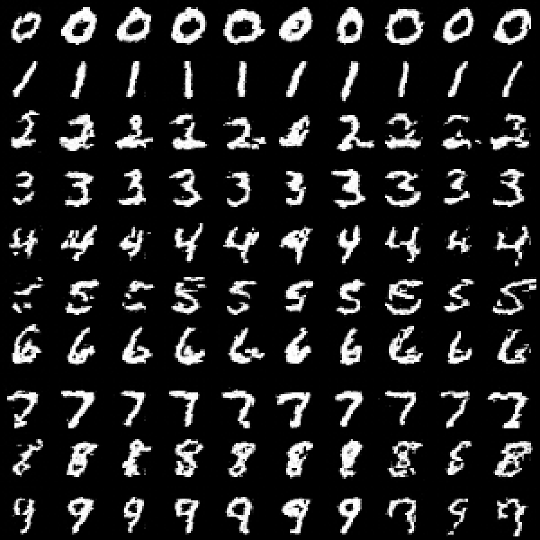
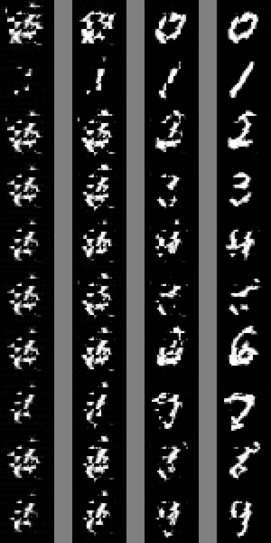
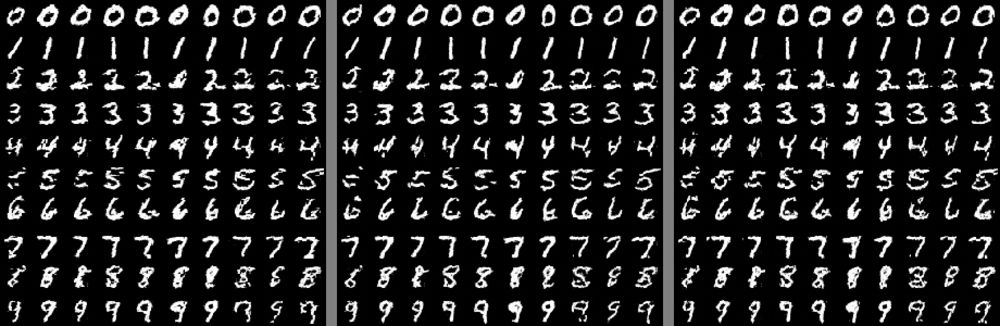
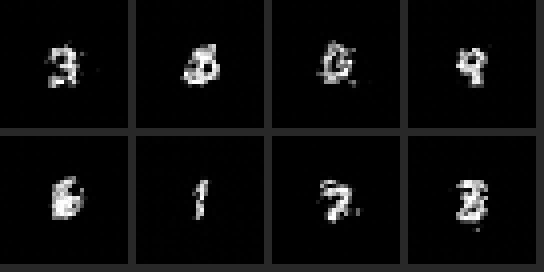
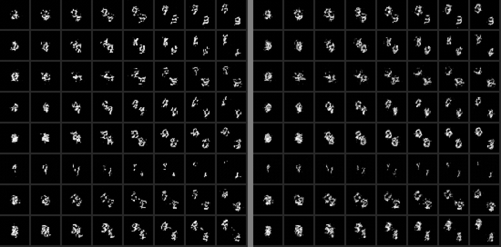
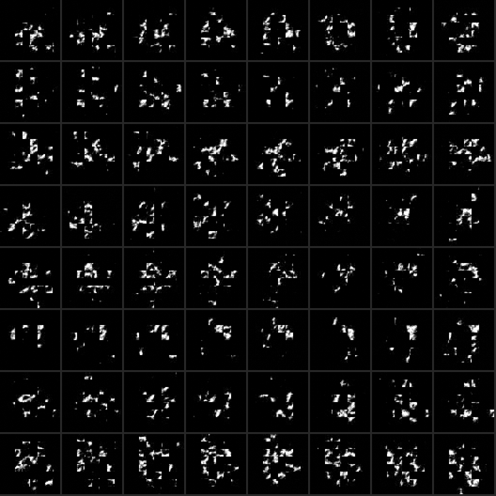
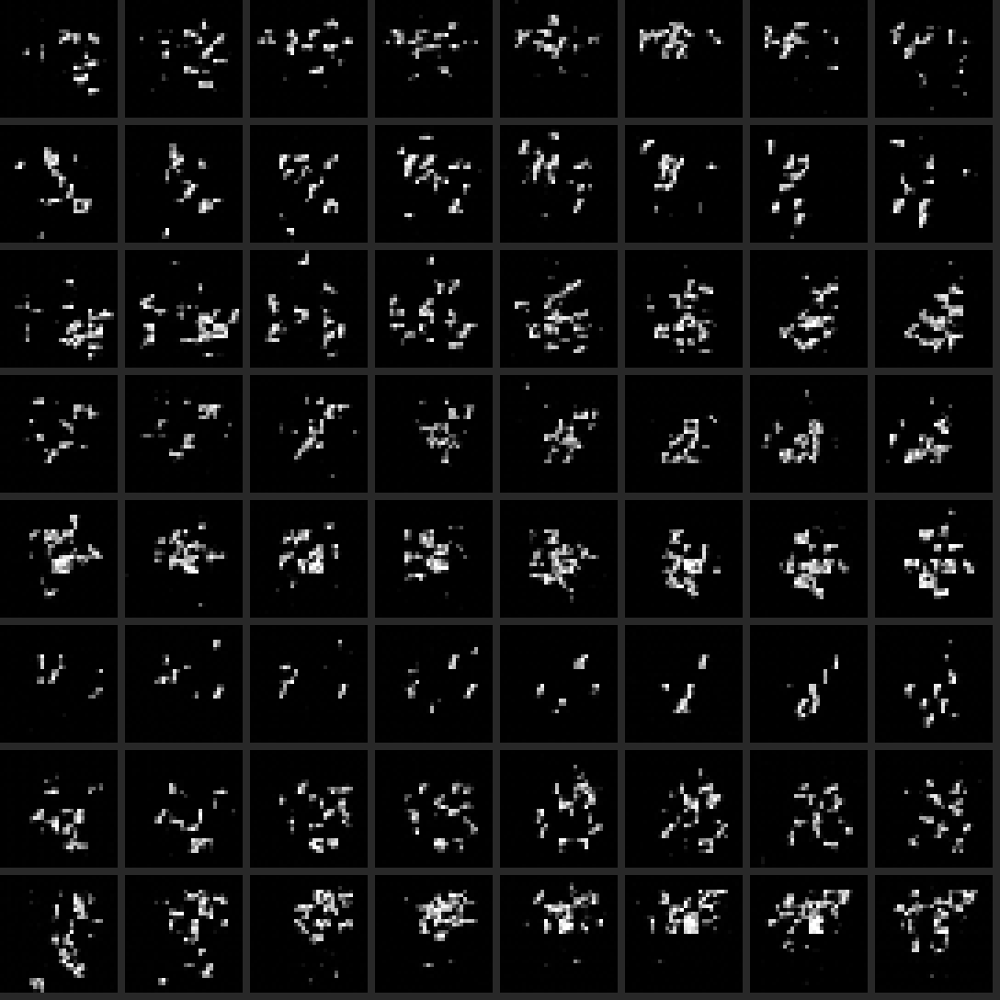

[← Back to the README](../README.md)

# Crate 1: `nervus` — where the learning actually happens

Zero dependencies. Read in this order:

1. **[`matrix.rs`](../crates/nervus/src/matrix.rs)** — three matrix products.
   `A@B` forward, `Aᵀ@B` for weight gradients, `A@Bᵀ` for input gradients.
2. **[`nn.rs`](../crates/nervus/src/nn.rs)** — the important one. Every layer
   implements `forward(x) -> y` and `backward(dL/dy) -> dL/dx`. Chaining the
   second one backwards *is* backpropagation.
3. **[`bin/train_mnist.rs`](../crates/nervus/src/bin/train_mnist.rs)** — the
   training loop: predict, score, blame, adjust.
4. **[`attention.rs`](../crates/nervus/src/attention.rs)** — self-attention,
   forward and backward, with the causal mask or without it. Read it after
   the rest: it is three `Linear` layers and two of the products from step 1,
   and the only new derivative in it is the softmax's.
5. **[`norm.rs`](../crates/nervus/src/norm.rs)** — LayerNorm and RMSNorm. The
   forward pass is two lines; the file is about the backward pass, and the
   argument that gets you there without the algebra: a normalised row cannot
   see its input being shifted or stretched, so the gradient must have no
   component in those directions. LayerNorm ignores both and subtracts two
   projections. RMSNorm ignores only the stretch and subtracts one.
6. **[`embedding.rs`](../crates/nervus/src/embedding.rs)** — token ids to
   vectors. A lookup does not look differentiable, but it is a `Linear` layer
   fed one-hot rows with the multiplications by zero skipped, so its backward
   pass is `Linear`'s with the same shortcut: add each gradient row into the
   table row its token selected. Add, not assign — a token used three times is
   to blame three times.
7. **[`block.rs`](../crates/nervus/src/block.rs)** — the residual connection,
   `y = x + f(x)`, and the transformer block, which is two of them. The backward
   pass is `dx = dy + f.backward(dy)`, and the first term is the point: whatever
   the branch does to the gradient, `dy` also reaches the layer below untouched.
   One test makes it concrete — 24 layers that each pass back about a tenth of
   their gradient deliver 3e-22 of it in a chain, and 1.5 of it with the `x +`.
8. **[`model.rs`](../crates/nervus/src/model.rs)** — a GPT. Token and position
   embeddings, a stack of blocks, a final norm, a head. Almost no new code,
   because almost nothing is new; what is new is why positions are needed at
   all, and how a model should be initialised so that it starts out ignorant
   rather than confidently wrong.
9. **[`optim.rs`](../crates/nervus/src/optim.rs)** — AdamW. SGD has one learning
   rate for a model whose gradients differ by orders of magnitude between
   tensors. Adam divides each parameter's gradient by how large that
   parameter's gradients usually are, and the size cancels: scale every
   gradient by 1000 and the trajectory does not change. What is left is sign
   and consistency, and `lr` comes to mean "how far a parameter may move per
   step". It lives outside the layers — they own parameters and gradients, it
   owns its running averages — and reaches them through `params()`.
10. **[`text.rs`](../crates/nervus/src/text.rs)** and
    **[`bin/train_text.rs`](../crates/nervus/src/bin/train_text.rs)** — from a
    text file to a model that writes. Nobody labels this data: the target at
    every position is the character that comes next, so one window of text is
    a whole batch of examples and a megabyte holds a million windows. Then
    generation, which is only "predict, draw, append, ask again" — and which
    recomputes every earlier position for every new character, the waste the
    KV cache in crate 2 exists to remove.
11. **[`checkpoint.rs`](../crates/nervus/src/checkpoint.rs)** — the trained
    model on disk. A model is a list of named arrays of floats and nothing
    else, so the only decision in saving one is which names — and those are a
    contract with whoever reads the file. This crate uses GPT-2's, so what it
    writes is a GPT-2 checkpoint that crate 2 loads with the code it uses for
    OpenAI's. ([`json.rs`](../crates/nervus/src/json.rs) is there because the
    files are JSON and the crate has no dependencies. It teaches nothing about
    networks; skip it.)
12. **[`dit.rs`](../crates/nervus/src/dit.rs)** and
    **[`flow.rs`](../crates/nervus/src/flow.rs)** — the same transformer, taught
    to draw. Patches instead of tokens, no mask, and a timestep and a label
    steering every norm; then flow matching, the objective FLUX and
    Qwen-Image were trained with, which turns out to be a straight line
    between an image and noise. See [Drawing instead of
    writing](#drawing-instead-of-writing) below.
13. **[`moving.rs`](../crates/nervus/src/moving.rs)** and
    **[`bin/train_video.rs`](../crates/nervus/src/bin/train_video.rs)** — one
    more axis: clips of two digits moving apart, made up on the spot, and
    attention that reads within a frame or across frames rather than
    everything at once. See [Drawing a clip](#drawing-a-clip).

## The test worth running first

```bash
cargo test -p nervus analytic_gradient_matches_numerical
```

It nudges one weight by ±0.001, measures how the loss actually moves, and checks
that against what `backward()` claimed. A subtly wrong gradient still trains,
just badly — this is the only thing that catches it.

Attention has its own, which checks every weight of all four projections and
the gradient handed back to the layer below. With correct derivatives the
analytic and numerical gradients differ by about 0.0007; drop the row average
from the softmax derivative, forget the `1/sqrt(d)` on the way back, or miss the
transpose in `dK`, and that becomes 0.2 to 0.8. Two more tests pin the causal
mask from both sides: the future cannot change the past's output, and the past's
loss cannot blame the future's input.

The norms get the same treatment, with one trap worth knowing about. Check a
fresh LayerNorm on inputs drawn from N(0, 1) and both `gamma` and the row's
standard deviation are 1 — so a backward pass that forgot to multiply by either
one passes. The tests use a scrambled `gamma` and inputs with a standard
deviation near 3 for exactly that reason. A gradient check is only as good as
the point you run it at.

The embedding has a better test available than a numerical one, and uses it:
build the one-hot matrix for real, push it through the matmuls from step 1, and
require the lookup and its gradient to match *to the bit*. No tolerance to tune,
because there is no approximation — the shortcut performs the same additions in
the same order.

Checking the whole block turned up two things no single layer had shown.

*ReLU cannot be checked tightly.* Nudge a weight and some hidden unit crosses
zero, where the slope jumps and a centred difference is simply wrong. Correct
gradients disagreed with their estimates by up to 0.011 with ReLU in the MLP,
and by under 0.0002 with GELU. That is why the block uses GELU, and it is not
cosmetic: dropping a `3` from GELU's own derivative measures 0.011–0.014, which
a ReLU-sized tolerance would have waved through.

*Attention's key bias does nothing.* The check reported a 100% disagreement on
one tensor. Adding the same vector to every key moves every score in a row by
the same amount, and softmax only sees differences within a row — so the
gradient is exactly zero, and the check was comparing rounding noise with
rounding noise. Move that bias by 5.0 and the output moves by 1e-6. GPT-2 ships
one in every layer. (RoPE rotates the keys after the bias is added, which makes
it matter again; Qwen has one for that reason.)

The assembled model has tests of a different kind, because its bugs are of a
different kind — not wrong calculus but forgotten wiring.

*A fresh model should know nothing.* Predicting every token equally costs
`ln(vocab)`, and that is what the first loss should be. With the He
initialisation that suits the MNIST network it is 0.92 higher, averaged over 40
seeds: almost a nat of confidence with nothing behind it, which training must
first undo. With GPT-2's N(0, 0.02) it is 0.003 higher.

*Every tensor must actually train.* `step` and `zero_grad` are forwarded by
hand through each composite layer, and a forgotten line is silent — that tensor
just never moves, and the model trains around it. A model whose position
embedding never updated still memorised its test sequence. So one test takes a
step and requires every tensor to have moved.

*It can memorise one sequence.* Loss 2.41 to 0.0001 in 100 steps. The oldest
sanity check there is, and the first time forward, backward and the optimiser
all have to agree, through every layer at once.

An optimiser has no gradient to check, but Adam makes promises exact enough to
test instead. With bias correction the first step is `lr * g / (|g| + eps)`, so
gradients of 500 and of 0.00001 both move their weight by `lr` — the second one
0.1% short, which is precisely what `eps` is for. A steady gradient covers `lr`
per step whatever its size; one that flips sign every step, at ±100, gets 0.018
from home in 200 steps that could have covered 2.0. In a valley a million times
steeper one way than the other, Adam reaches the bottom along both axes in 300
steps; SGD, at the largest learning rate the steep axis allows, moves 0.0006
along the shallow one. And with no gradient at all, only weight decay acts:
matrices shrink by `1 - lr * decay` a step and biases and gains do not move —
the test that tells AdamW from Adam with L2 folded into the gradient.

## Things to try

- `--hidden 16` — how small before accuracy collapses?
- `--lr 0.5` — watch it diverge. `--lr 0.0001` — watch it crawl.
- `--momentum 0` — see how much of the speed was momentum.
- Note that training loss keeps falling after epoch 5 while test accuracy
  flatlines. That gap is overfitting, live.

**Momentum is a multiplier on your learning rate.** At steady state the velocity
converges to `lr·g/(1−μ)`, so `--lr 0.1 --momentum 0.9` really steps at ~1.0.
That is why the default is 0.02: at 0.1 this model plateaus at 95%, at 0.02 it
reaches 98%.

## Training a GPT on a text file

```bash
./scripts/get-text.sh        # tiny Shakespeare, 1.1 MB; or bring your own
cargo run --release -p nervus --bin train_text
cargo run --release -p nervus --bin train_text -- --data README.md
```

Any plain text works. The numbers below are from the second command — this
README, 50 KB, as the entire training set — because it was the text to hand.
Defaults: 2 layers, 4 heads, `d_model` 64, context 64, 117,221 parameters. The
run below took 91 seconds for its 2000 steps, at about 22,000 characters a
second on one core of an M5 Pro. It takes about 11 seconds now, for reasons given
under [Where the time went](#where-the-time-went); the losses and samples are
from the slower code and have not been regenerated.

```
loss to beat: 4.615 knowing nothing, 3.378 knowing only letter frequencies

step   250  train loss 2.924  validation loss 2.767
thatrir po the, the man as ivilt nth  ate  tasar at<(d wcat rach, isthath 0

step  1250  train loss 1.666  validation loss 1.909
quantisation not shat mak is it — sare prop is behad line changed that it

step  2000  train loss 1.334  validation loss 2.261
> measured gather step is all, and the same scomentum onhere that of
```

The two numbers at the top are what make the rest readable. `ln(vocab)` is a
model that knows nothing; the second is one that knows which characters are
common and nothing about their order. Everything below that was learned from
order: first that letters come in word-sized runs, then which runs, then
markdown. By the end it has opinions about quantisation.

It is also overfitting, in plain sight. Validation loss bottoms out near step
1250 and climbs from there while training loss keeps falling — 45 KB is little
enough to start memorising. The validation set is the *end* of the text rather
than a random sample, because windows overlap: sample at random and nearly every
validation window shares most of its characters with a training window, and the
number measures memory.

**AdamW earns its place here, which it did not on the toy problem.** Same
model, same text, 750 steps, each optimiser at the best of the learning rates
tried for it (AdamW: 0.001–0.03, best 0.003; SGD with momentum: 0.01–1.0, best
0.1, diverging to NaN at 1.0). Validation loss over four seeds: AdamW 2.18–2.47,
mean 2.26; SGD 2.56–2.65, mean 2.59. AdamW is ahead on every seed, though one
of its four is a good deal worse than the others. Warm-up was the guess, and
[it was right](#the-seed-that-was-worse-than-the-others).

**A mistake no training run can reveal.** A batch here is a loop — the model
takes one sequence at a time and gradients accumulate — so each window's
gradient has to be divided by the batch size. Forget to, and the gradient is a
sum rather than a mean: `batch` times too large. Under SGD that is a learning
rate `batch` times too high and you would notice. Under Adam it is *nothing*,
because cancelling the size of the gradient is the whole point of Adam; the
model trains identically. It stays wrong, waiting for the day someone changes
the optimiser. The test for it uses a text with exactly one possible window, so
that a batch of three must produce the same gradient as a batch of one.

Things to try: `--layers 1` or `--d-model 32`, to see how little is needed to
learn spelling; `--context 8`, to see what a model that cannot see a whole word
writes; `--temperature 0.2` against `1.5`; `--warmup 0 --decay-to 1 --clip 0`,
which is how every run in this repository worked before
[the schedule](#the-seed-that-was-worse-than-the-others) was measured; and
`--steps 6000` on a small file, to watch the validation loss leave.

## Keeping what it learned

```bash
alias train_text="cargo run --release -p nervus --bin train_text --"
train_text --data README.md --save out/readme
train_text --load out/readme --steps 0 --prompt "## "     # just write
train_text --load out/readme --data README.md --steps 500 --save out/more
```

`--save` writes a directory of three files: `model.safetensors`, `config.json`
and `tokenizer.json`. They are GPT-2's names, GPT-2's tensor layout and the
HuggingFace tokeniser format, written by hand with no library — the 117K model
is 471 KB, all but 2.4 KB of it floats. The tokeniser has to travel with the
weights: id 17 means whatever character was seventeenth in *that* text, and a
loaded model refuses text containing a character it has no row for.

Saving and loading back bit for bit is tested, and proves less than it seems
to. A writer and a reader that share a misunderstanding — query and key in the
wrong thirds of GPT-2's fused matrix, say — agree with each other perfectly.
The only real test of a file format is a second implementation, and this
repository has one: [a test in crate 2](../crates/llm/tests/nervus_checkpoint.rs)
saves a `nervus` model, loads it with the GPT-2 code written to run OpenAI's
weights, and requires the same logits at every position. They agree to 5e-7 of
their size. Of 22 mistakes made on purpose, the round trip missed the ones made
the same way in both directions; that test caught every one that touched the
layout, the smallest at 0.2.

It also had a hole of its own, found the same way. With the floats written
big-endian the engine loads garbage and produces NaN — and the test passed,
because `f32::max` prefers anything to a NaN, so the largest difference between
two rows of NaN came out as zero. A comparison that cannot fail on NaN is not a
comparison.

Two things in the file are not GPT-2's. Its output head is its own tensor with
a bias, where GPT-2 reuses the embedding table, so the config says
`tie_word_embeddings: false` and the engine's GPT-2 learned to honour that. And
the optimiser's state is not saved: a resumed run starts Adam's averages from
nothing. Measured against the same run left alone, that cost 0.06 and 0.04 of
training loss over the first 50 steps on two seeds, nothing on a third, and
nothing visible on any by step 100.

`--save` keeps the best model rather than the last — see
[One tool: `kvad train`](#one-tool-kvad-train), where the same loop gets a
name and a home.

## Where the time went

Training ran at 22,000 characters a second, and the plan was to use more cores.
A profiler was run first — this repository has
[been burned before](engine.md#the-floor-under-everything) — and eight seconds of
`sample` said something nobody had guessed:

| | share of the time |
|---|---|
| `matmul_a_bt` (`dx = dy @ Wᵀ`) | 49% |
| `matmul` (`y = x @ W`) | 18% |
| `matmul_at_b` (`dW = xᵀ @ dy`) | 13% |
| `tanh`, inside GELU | 10% |

Three matrix products do the same number of multiplications, and one of them
cost as much as the other two and everything else combined. The other two add
a multiple of one row into another, which a compiler turns into SIMD without
being asked. `matmul_a_bt` was a dot product: `acc += a[p] * b[p]`. Floating-
point addition is not associative, a compiler may not change what a program
computes, and so it may not reorder that sum; each addition waited for the one
before it. The disassembly showed the multiplications vectorised four at a
time and the additions done singly, in a chain. The fix is to say in the code
that the order is free — keep eight running sums and add them up at the end
([`matrix.rs`](../crates/nervus/src/matrix.rs)). Four sums did nothing; 16 and
32 were slower than 8, because attention's vectors are 16 long and a chunk that
does not fill falls to the slow loop. GELU was computing each `tanh` twice,
forward and again backward, and now keeps it.

Then the cores. The windows of a batch are independent until their gradients
are added, so `text::Replicas` gives each thread a copy of the model and a
share of the windows, and adds the gradients into the one model with an
optimiser: broadcast, compute, all-reduce, which is data parallelism as a GPU
cluster does it, with a core for a GPU and a `memcpy` for the network. Window
`i` always goes to replica `i mod n`, so a run is reproducible for a given
thread count; between thread counts only the order of a sum differs. Over 1000
steps on three seeds, 1 thread and 16 printed the same training and validation
loss to three decimals at every checkpoint but one, where they differed by
0.001.

| characters a second, batch 16 | range over 5 runs | median |
|---|---|---|
| as it was | 20,600–21,700 | 21,500 |
| eight-lane dot product, `tanh` kept; 1 thread | 36,100–37,300 | 36,400 |
| 6 threads | 141,400–145,700 | 143,900 |
| 12 threads | 142,900–192,300 | 177,100 |
| 16 threads (one window each) | 163,200–208,900 | 190,200 |

That is 1.7x from two changes to the arithmetic and 5.2x more from threads:
8.9x. The default 2000 steps, sampling included, take 10.5 to 12.7 seconds
rather than 91. The runs were interleaved, five of each, on a machine 70% idle
before and 87% after. An earlier attempt is worth recording: halfway through
it another job started 144 processes that spin forever, the unchanged code
measured a third of its own speed, and every ratio held while every absolute
number was wrong.

Sixteen threads buy 5.2x, not 16x, and the profiler says why. This machine has
6 fast cores and 12 slow ones; every step ends when the slowest thread does, and
the main thread spent 73% of its time waiting. Six threads, which fit on the
fast cores, get 4.0x, and repeat to within 3%; past six the range opens to 28%,
because it depends on which cores the scheduler picks. Letting threads pull windows from a shared queue, so that
fast cores take more, was tried and measured no better than noise at these
batch sizes — and it would cost reproducibility, since which replica sums which
windows would then depend on scheduling. The rest is the serial part: adding up
16 copies of the gradient, AdamW, and starting 16 threads a step, together
about a quarter of the main thread's time.

## The seed that was worse than the others

Four AdamW seeds, and one of them finished at validation 2.47 against about
2.19 for the rest. The guess written down at the time was learning-rate
warm-up. It was a guess; this is the measurement.

First, reproduce it. Eight seeds this time, 750 steps, the same 117K model on
this README, validation loss at the end (which is now measured on a fixed set
of windows, so two runs are comparable):

| `--lr` | per seed | worst | mean | spread |
|---|---|---|---|---|
| 0.001 | 2.43 2.46 2.44 2.46 2.44 2.47 2.43 2.45 | 2.47 | 2.446 | 0.037 |
| 0.002 | 2.31 2.31 2.37 2.33 2.36 2.40 2.31 2.34 | 2.40 | **2.343** | 0.094 |
| 0.003 | 2.40 2.45 2.30 2.40 2.32 2.41 2.29 2.29 | 2.45 | 2.358 | 0.167 |
| 0.006 | 2.69 2.56 2.43 2.62 2.60 2.67 2.55 2.57 | 2.69 | 2.587 | 0.258 |
| 0.01 | 2.81 2.80 2.73 2.79 2.80 2.81 2.77 2.78 | 2.81 | 2.786 | 0.082 |

There it is, and it is not really "one seed in four". It is that **the spread
grows with the learning rate** — 0.037, 0.094, 0.167, 0.258 — until at 0.006
every seed is bad. The bad seed was the first sign of a ceiling the runs were
already pressed against.

That is the shape warm-up predicts. Read
[`optim.rs`](../crates/nervus/src/optim.rs) on bias correction again: it exists
so that the *first* step moves every parameter by the full `lr`, in the
direction of a gradient estimated from one batch, and `v` is an average of one
sample. Adam is at its most confident exactly when it knows least. Nothing
diverges visibly, because the damage is a handful of early steps in a poor
direction; it shows up later as one run ending worse than its neighbours.

So: four arms, each swept over the same six learning rates and the same eight
seeds, each reported at its own best rate.

| arm | best `--lr` | per seed at that rate | mean | spread |
|---|---|---|---|---|
| flat | 0.002 | 2.31 2.31 2.37 2.33 2.36 2.40 2.31 2.34 | 2.343 | 0.094 |
| cosine decay only | 0.002 | 2.39 2.41 2.48 2.45 2.45 2.46 2.44 2.39 | 2.434 | 0.094 |
| warm-up only | 0.006 | 2.27 2.30 2.33 2.33 2.34 2.29 2.28 2.31 | 2.305 | 0.069 |
| both | 0.006 | 2.25 2.26 2.29 2.31 2.31 2.25 2.26 2.27 | **2.275** | 0.058 |

Three things worth saying out loud.

**Warm-up works, and not by making a good run better.** At 0.003 it is worth
0.025 (2.358 to 2.333) and nothing you would notice. What it does is raise the
ceiling: the flat arm falls apart at 0.006 and the warmed-up arm is at its best
there. The gain is three times the usable learning rate, and the improvement is
what the extra rate buys.

**Cosine decay alone is worse than doing nothing** — 2.434 against 2.343. Of
course it is: without a higher peak to pay for it, decaying the rate is just
training at a lower average rate. It earns its place only on top of warm-up,
where it is worth a further 0.03, and the floor barely matters (0.1 and 0.3
measured 2.275 and 2.273; even 1.0, which is no decay at all, gives 2.305).

**The warm-up has to be long enough to be one.** At `--lr 0.006` with the
cosine, over eight seeds: 10 steps of warm-up scored 2.627 and 25 scored 2.452
— *worse than no warm-up at all* — 50 gave 2.343 with one seed still at 2.70,
and 100 gave 2.275. That is why the default is a share of the run, a tenth,
rather than a number of steps: ten steps is a tenth of a hundred and a
seventy-fifth of the default run. (Half the run measured 0.025 better again, at
750 steps and at 2000, but the sign flipped on two of eight seeds, so it is
inside the spread and a tenth is what everyone uses.)

At the real default length of 2000 steps the effect is smaller and the same
shape. The current default — `--lr 0.003`, no schedule — scores 2.138 over
eight seeds. Turning warm-up, cosine decay and clipping on and changing nothing
else scores **2.087**, with the spread down from 0.052 to 0.041. And the
learning rate almost stops mattering: 0.003, 0.006, 0.01 and 0.02 land at
2.087, 2.097, 2.111 and 2.120, where the flat arm had already lost 0.45 by
0.01. That is the part that matters for a tool: the knob you are least equipped
to set is the one that now matters least.

**Gradient clipping is insurance, and the measurement says so exactly.** If the
whole gradient — every tensor laid end to end — is longer than `--clip`, every
element is scaled by one number, so the direction is untouched. At the good
setting it does nothing: 2.275 without it, 2.269 to 2.308 across thresholds
from 0.25 to 2.0, all inside the seed spread. At a bad setting it does
everything. At `--lr 0.02`, where warm-up alone is not enough, eight seeds ran
2.29 2.69 2.28 2.73 2.76 2.80 2.31 2.77 — mean 2.578, spread 0.517. With
`--clip 1` the same eight ran 2.31 2.30 2.28 2.32 2.30 2.31 2.28 2.31 — mean
2.301, spread 0.036. It cannot replace warm-up, though: on the flat arm at
0.006 it recovered 0.1 of the 0.24 and left the spread wider than it found it.

It is not free. Clipping is one extra pass over every gradient each step, and
on the 117K model that is 13% of training throughput (median of five
interleaved runs: 257,500 characters a second without, 221,700 with). On the
4.9M `large` preset it is not measurable at all — 7,139 against 7,185, inside
the noise — because there the arithmetic dwarfs it. So the cost falls entirely
on the run that takes nine seconds and not at all on the one that takes twenty
minutes, which is why it is on by default.

The obvious optimisation was tried and refused. A left-to-right sum of a
hundred thousand squares is a chain of additions each waiting on the one
before, which is exactly the problem [eight running sums
fixed](#where-the-time-went) in `matmul_a_bt`. Eight running sums here moved
the cost from 13.9% to 12.3%, which is inside the run-to-run noise, so the
simpler code stayed: the cost is the extra pass over the gradients, not the
order they are added in. (The sum is in `f64` for a different reason, and that
one is real — on a hundred thousand gradients of 1e-3, `f64` gives the correct
0.3162278 and `f32` gives 0.3160589.)

## Where the text comes from: `kvad crawl`

```bash
kvad crawl https://doc.rust-lang.org/book/        # writes doc.rust-lang.org-book.txt
kvad train --data doc.rust-lang.org-book.txt --name rustbook
```

`--data corpus.txt` assumes somebody has a corpus. `scripts/get-text.sh`
fetches tiny Shakespeare and that is the whole of the supply, so `kvad crawl`
reads a documentation site into a text file instead — and the Datasets page in
the web UI does the same thing as a job you can watch.

**The scope is the directory, not the domain.** This is the decision the
feature turns on. `doc.rust-lang.org/book/` links into `/std/` on nearly every
page, so a crawl that stayed on the domain comes back with the whole of the
standard library's rustdoc — tens of thousands of pages of generated
signatures, which is not what anyone meant by "the book". Links are followed
under the starting address's own directory: `/book/` for that address, and
`/book/` still for `/book/ch03-00-common-programming-concepts.html`.
`--same-host` widens it for the sites that are one book at their root.

The extractor is a tag scanner rather than a parser or a dependency, because a
documentation site is one program's output from one template. Headings, lists,
tables and fenced code blocks with their language survive; `<script>` is read
as raw text so that `a < b` in JavaScript is not a tag; `<nav>`, `<footer>`
and `id`/`class`/`role` furniture are dropped by token. Links are collected
from the *whole* document and the text only from the furniture-free part — a
book's table of contents is its sidebar, and a crawler that dropped the
sidebar before looking for links fetches one page and stops.

**Then the part that decides whether any of it is trainable.** A character
tokeniser gives an id to every distinct character and the model gets a row per
id, so the alphabet is a hyperparameter, and the web is bad at keeping it
small: three kinds of quotation mark, two kinds of dash, a non-breaking space
before every unit, one emoji in a warning box. Typography is mapped onto ASCII
— not NFKD, which would also take the accents off `blåbær` — and what is left
of the tail is dropped by count. Ten pages of the book:

```
10 pages, 99,684 characters, 95 distinct
277 characters mapped onto ASCII (237 of them ’ → '), one emoji dropped
```

Six pages come out at 81 distinct characters, every one of them ASCII, against
the 101 of this README. The threshold is an absolute count and not a share of
the corpus, because that is what the number means: a row of an embedding table
seen eight times is untrained whether the text around it is 5 kB or 5 MB. It
started at 3 and is 10, from measuring — at 3, a 325,334-character crawl still
kept about forty rows for the Japanese, Hindi, Hebrew and Cyrillic in one
chapter's "hello world" examples, seen three to fifteen times each. ASCII is
never dropped however rare it is.

**Pointing it at the real thing is what found the bugs.** `class="header"` was
in the furniture list, and that is exactly how mdBook and rustdoc mark every
heading's anchor: every heading on every page was being deleted, and the
orphaned `# ` then landed on the paragraph below. The same first run produced
1,319,972 characters from three pages, because `/book/` and
`/book/title-page.html` are one page at two addresses and `print.html` is the
entire book again. Pages are deduplicated by the hash of their text now, and
`print.html` and rustdoc's `all.html` are passed over by name.

Beside the text goes `<file>.crawl.json`: the start address, the scope, every
page in the order it was fetched, what was skipped and why, what the cleaning
pass changed, and the alphabet it ended with. In six months that is the
difference between "a corpus" and "this corpus, from here, on that day".

`robots.txt` is obeyed, there is a pause between requests, and the crawl stops
at a number of pages and a number of bytes — a crawler an admin session can
point at a stranger's server should be boring. Addresses resolving to
loopback, RFC1918 or link-local are refused and rechecked on every redirect,
because "fetch this URL for me" is the shape of request that otherwise reads a
cloud metadata endpoint into a file. That check is of the name and not of the
socket, which a resolver of our own would close and nothing less will.

## Answering from a corpus, without training one

Training cannot put facts into these models. A character model has nowhere to
keep them, and the downloaded models cannot be trained here at all — there is
no backward pass for those architectures, only a forward one. So the corpus a
crawl produces is useful the other way round: keep the text, find the part of
it that bears on the question, and put that in the prompt. The model learns
nothing and reads something.

```
kvad crawl → dataset → chunks → BM25 → the five best passages + the question
                                                ↓
                       an instruction-tuned model, which reads them
```

**The index is arithmetic, not a second model.** The modern answer is
embeddings, which would mean adding a BERT-class encoder — a whole
architecture, not a feature — to be worse at the thing a documentation corpus
is made of. `Vec<T>`, `unwrap`, `trpl::join` are not fuzzy concepts to be
matched by meaning; they are strings, and a question containing one is nearly
always about it. BM25 is thirty years old, is four lines of arithmetic, and
can say *why* each passage came back, which an embedding cannot do at all.

There is no stop-word list, because a word in every chunk has an inverse
document frequency near zero and changes no ranking — and a hand-kept list
would be wrong for a corpus about the word `if`. There is no `chunks` table
and no migration either: the Rust book chunks in 7 ms and indexes in 14 ms,
which is less than the round trip that asked for it, so the index is built on
demand and kept until the file under it changes.

**Two bugs this found in the crawler, both by looking at output.** Citations
pointed at the wrong chapter, because `text.starts_with('#')` is true of `##`
as well — mdBook opens most chapters with an `<h2>`, so 85 of the book's 111
pages had no heading of their own and were filed under whichever page came
before them. 26 top-level headings for 111 pages. And the URLs carried the
`#fragment` of whichever link first pointed at them, so a page was cited by a
heading halfway down itself.

**And two in the ranking.** Asked "how do I make a vector", the top result was
a chapter on I/O with no vector in it — because the cutting rule turns `I/O`
into the word `i`, almost no passage contains a lone `i`, and BM25 pays well
for rare words: `i` scored 5.1 against `vector`'s 5.0. Single characters are
dropped now, in the question and in the index; `Box<T>` is found by `box`.
Separately, a passage that matched only the question's common words was
scoring 21% of the best hit on a small corpus — so if a question contains
anything specific, a passage now has to have matched something specific, and
if it contains nothing specific the rule is not applied at all, because then
a corpus entirely about vectors should still answer "vector".

**Ranking wants small chunks and reading wants whole ones**, and they are not
the same size. Asked what happens to a reference after a push, the three best
hits were chunks 885, 886 and 888 of one section, handed over as three
unrelated items in score order — and 887, between two of them, had not ranked
at all. So a hit is grown to its neighbours and overlapping runs are merged:
those five hits became two passages, one of them chunks 884–892, the whole
section in order. Never across a page, because the chunk after the last one of
a page is the first of another.

A merged passage can outgrow the prompt budget, and the section above is 6,921
characters against a budget of 4,000 — with the part that answers the question
near the end, so cutting from the front removes precisely the answer. It is
cut around the paragraph that earned the score instead, found by adding up
what each of the question's words contributed to each paragraph: the same
judgement the ranking made, applied one level down.

**A question is phrased in its asker's words, not the corpus's.** The book
says `push` fifty-five times and `pushing` five, so a question about what
happens "after pushing to the vector" shared no word with the passage that
answers it — and the one term that separates that section's two halves counted
for nothing, leaving the ranking to `element` and `vector`, which are spread
evenly over both. Every earlier measurement of that question was really a
measurement of this.

So: Porter's stemmer, the whole algorithm rather than three rules. Stripping
`-ing`, `-ed` and `-s` by hand is thirty lines and turns `string` into `str`,
which on a corpus of code does more damage than it repairs. Porter's rules are
conditioned on the *measure* of what would be left, and `str` has a measure of
zero and not a vowel in it — so `string` is left alone while `pushing`
reduces. It collapsed the book's vocabulary from 5,392 distinct words to
3,406, and indexing still takes under 40 ms. It is not linguistics: `closure`
becomes `closur`. Both sides of the index go through the same function, so
what is asked of it is that it agree with itself.

**And the budget is the model's, not a constant.** 4,000 characters is a
comfortable fifth of a 2k context and an unusable thirtieth of a 32k one. The
section that answers the question above is 4,096 characters, so a flat 4,000
cut the answer off the end of it — retrieval had done its job and the trim
undid it. Two fifths of the window, capped, because a 32k model handed fifty
thousand characters pays prefill for them on every turn and buries the passage
that matters among four that do not.

**The part worth keeping is that the two halves are measured apart.** Whether
the right passage comes back and whether the model then reads it properly are
different questions that fail for different reasons. Asked what the book says
about using a reference to an element after pushing to a vector, the
ungrounded 0.5B model invented a "reference to the vector's capacity", which
is not a thing. Grounded, it stopped inventing — and answered a different
question, about indexing past the end. The search endpoint says which of those
happened: all five passages were from the right section of ch08-01, and the
one about the borrow checker was ranked second. Retrieval was right and the
reader picked wrong. Without a way to ask the two questions separately, that is
indistinguishable from "RAG does not work".

## One tool: `kvad train`

```bash
kvad train --data corpus.txt --name shakespeare    # train a new model
kvad train --from shakespeare --data more.txt      # train it further
kvad run --model shakespeare --prompt "ROMEO:"
kvad ls                                            # it is listed, by name
```

`train_text` and `kvad` used to be two programs with a directory passed
between them. They are one now, and the joining piece is a name. `--name
shakespeare` writes into `$XDG_DATA_HOME/kvad/models/shakespeare`, and from
then on the bare word means that model wherever you are: `kvad run --model
shakespeare`, `kvad use shakespeare`, `kvad rm shakespeare`, `kvad-tui
shakespeare`. A model name is resolved in three steps — a directory of that
name that exists, then a model trained here, then a Hub repo id — and the
three cannot collide by accident, because a repo id always has a slash in it
and a name may never have one. A directory still wins, which is the rule
`transformers` uses.

The training loop itself did not move house so much as move down a floor. It
lives in [`nervus::text::train`](../crates/nervus/src/text.rs) now, where
both front ends call it: `train_text` still takes `--layers`, `--d-model`,
`--heads` and `--context` one at a time, for seeing what each of them does,
and `kvad train` takes `--size` instead, along with `--warmup`, `--decay-to` and
`--clip`, whose defaults come from
[the measurement above](#the-seed-that-was-worse-than-the-others). Nothing
about the learning changed in the move, and tests say so: every loss a run reports is the same however many
threads it uses (to 2.6e-5 — the losses and not the weights, because replicas
sum in a different order and Adam divides by the size of the gradient, so
where a gradient is near zero a difference of 1e-7 in it is still a step of a
whole learning rate), and the training loss a checkpoint prints is the mean
since the last one, including a final interval shorter than the rest — which
is invisible whenever the steps divide evenly, as the defaults do.

**It keeps the best model, not the last.** A run on a small text overfits in
plain sight — validation loss bottoms out and then climbs while training loss
keeps falling — and the old `--save` wrote whatever step the run ended on,
which is the memoriser. Now the directory is rewritten every time validation
improves, and a run that gets worse leaves the good model where it was. This is
early stopping done by keeping the best rather than by halting: the run still
finishes and still prints, so the overfitting stays visible instead of being
hidden by a loop that quietly gave up.

That promise used to stop at the edge of a run. The bar a checkpoint has to
beat started at infinity every time, including for a `--from` continuation —
and a continuation *is* the model it would overwrite, so its first checkpoint
always wrote, whatever it scored. Caught in the act while continuing a model
trained on the Rust book: a run restarts the learning-rate schedule, spends its
warm-up climbing back to the peak rate, and so measures *worse* than the model
it started from for the first several hundred steps. Validation went 1.152 to
1.253, and 1.253 was saved over the 1.152. That run recovered; a run that was
interrupted, or one that simply never helped, left you holding a worse model
than you started with and no way back.

A continuation now measures the model it was handed before step 1 and makes
that its bar, which costs one validation pass and buys the whole promise: a
continuation that helps nothing changes nothing, and says so — `nothing beat
the model this run started from: it scores 0.796, and the best checkpoint here
reached 34.307`. The test is a corpus that contradicts its own validation
split, where training can only make validation worse, and it asserts on the
bytes of `model.safetensors` rather than on a loss: the file has to be the same
file afterwards.

That comparison only means something if the two losses are measured on the
same windows, and they were not: evaluation drew from the training generator,
so every checkpoint scored a different sample — and, worse, `--eval-every 100`
and `--eval-every 250` trained two different models, because the draws came
out of the same stream as the training windows. Evaluation has a generator of
its own now, seeded the same way every time.

**`--from` is the owner's "add new training sets to existing models",** and it
has two limits worth saying out loud, both of which are in `kvad train --help`:

* **The vocabulary is fixed at first training.** A character tokeniser gives
  ids to the characters it saw, and the model has one row per id in its
  embedding table and one in its output head. There is no row to give a
  character that was not there the first time, so text containing one is
  refused, and the message says which character it was. Training a new model
  on both texts together is the answer.
* **The optimiser's state is not saved.** AdamW keeps two running averages per
  weight and a resumed run starts them from nothing. Measured: at most 0.06 of
  training loss over the first 50 steps on two seeds, nothing on a third, and
  nothing visible on any by step 100.

`kvad ls` lists trained models in a section of their own rather than mixed in
with downloads, and `kvad rm` says something different about them, because they
are a different kind of thing: a downloaded model can be fetched again and a
trained one cannot. Twenty-nine mutations were made on purpose to see which of these
claims a test would actually defend — the last model saved instead of the best,
a bar that starts at zero so nothing is written, the tokeniser left out of the
directory, `..` accepted as a model name, a name sent to the Hub without being
looked for here, an unseen character quietly given a fresh vocabulary. Two
survived the first pass, and both were real gaps: nothing required two
checkpoints in one run to be measured on the same windows, and nothing stopped
two directories with the same last component from being one model to the
quantised-weight cache. Both have tests now.

**`--size` is measured, not guessed.** Three shapes, timed the way everything
in this repository is timed — interleaved, five runs of each, on this README
as the training text, batch 16, all 16 threads, an M5 Pro 93% idle. The
parameter counts are for that text's 101 characters: the embedding table and
the output head are as wide as the vocabulary is, so another text gives
another count.

| `--size` | shape | parameters | chars/s, 5 runs | median | default 2000 steps |
|---|---|---|---|---|---|
| `small` | 2 layers, d_model 64, ctx 64 | 117,221 | 137,100–260,600 | 228,800 | 9 s |
| `medium` | 4 layers, d_model 128, ctx 128 | 835,685 | 38,500–52,000 | 39,500 | 1m 44s |
| `large` | 6 layers, d_model 256, ctx 256 | 4,856,421 | 5,800–7,700 | 7,000 | 19m 25s |

(Sampling off and one validation pass at the end, which is why `small` comes
out at 9 seconds where [the threads table](#where-the-time-went) says 10.5 to
12.7 for the same run with sampling on. The ranges are wide for the reason
given there: 16 threads on 6 fast and 12 slow cores, and every step ends when
the slowest one does.)

Those numbers are from one machine, though, and a table in a README cannot
know yours. So the run times its own first ten steps and says what it expects
to cost here, before there is anything to regret:

```
$ kvad train --data README.md --name big --size large
size large: 6 layers, 8 heads, d_model 256, context 256
model: Gpt(6 layers, 8 heads, d_model 256, vocab 103, context 256, 4857447 params)
loss to beat: 4.635 knowing nothing, 3.341 knowing only letter frequencies
7958 characters a second here — about 17m 04s to go. Ctrl-C now if that is too long.
```

Ten steps is the whole cost of knowing, and on the slowest preset that is
about nine seconds. Which is also the shape of the next problem: five million
parameters is a fifth of the 10–30M this repository wants to reach, and it
already takes twenty minutes to do two thousand steps. The
[roadmap](roadmap.md#finishing-the-story) says what that costs and what would have to
change.

## Running it in the engine

```bash
kvad run --model readme --greedy --prompt "## "     # a name, or a directory
kvad use readme              # make it the default, from any directory
kvad-tui readme              # open the TUI with it loading
```

Wherever the engine takes a repo id it takes a name or a directory, by the rule
`transformers` uses: a directory that exists wins. From there it is the same
code path as a model from the Hub — the same loader, tokeniser, KV cache and
quantised kernels — so the 117K model gets `--quant q8` for free. (How fast it
is cannot honestly be said: its context holds 64 tokens, the run is over in
about 20 ms, and six of them measured anywhere from 970 to 5,600 tokens a
second.) With sampling off, the engine and `nervus` wrote the same 61
characters for each of three trained models; [a test](../crates/llm/tests/nervus_checkpoint.rs)
makes that journey on every run, from a text to a trained model to a directory
to the engine's output.

This is a base model in the plainest sense: it continues text. It has no chat
template and no idea what a question is, and a prompt containing a character it
never saw loses that character silently, because that is what the tokeniser
library does with one.

**The bug that was waiting for this.** The quantised-weight cache has to know
whether a checkpoint is still the file it quantised. For Hub models it reads
the content hash out of the HuggingFace cache's symlink, for free. For any
other file it fell back to the size — and the size of a checkpoint is decided
by the architecture, so a model retrained and saved over itself is the same
length *to the byte*. Reproduced before it was touched: train, run with
`--quant q8`, retrain into the same directory, run again, and the engine mapped
the old cache and wrote the old model's text under the new model's name, while
`--quant f32` beside it wrote the new one's. Nothing had ever saved over a
checkpoint before, so nothing had ever hit it. The identity is now the size and
the modification time — `make`'s answer, with `make`'s flaw, that a copy which
preserves timestamps can defeat it. Hashing would close that, and would cost
more on a hand-placed 8 GB checkpoint than the cache saves.

## Drawing instead of writing

```bash
cargo run --release -p nervus --bin train_digits
```

That trains a model that draws handwritten digits from noise, from random
weights, in about six minutes on this machine's CPU. It is the same kind of
model as FLUX and Qwen-Image, trained with the same objective, and about ten
thousand times smaller than FLUX (1.28 million parameters against 12 billion):



*The default run (seed 1337) after 4,000 steps: each row asked for one digit,
each column started from one fixed image of noise.*

There is less new code in it than the result suggests, because the models
people use to make pictures are transformers. [`dit.rs`](../crates/nervus/src/dit.rs)
is the GPT above with four changes. A 28×28 digit is cut into 49 patches of
4×4, and one `Linear` turns each into a vector, where the GPT looked a token
up. Attention loses its mask, since no patch comes "after" another. The
output is 16 numbers per patch, put back where the patch came from. And the
model is told two things besides the picture — how noisy it is, and which
digit to draw — through the one idea that is new: each norm's scale and
shift, fixed numbers in the GPT, are computed from those two things instead,
along with a gate on each branch that starts at zero, so that every block
begins as the identity (adaLN-Zero, from the DiT paper).

The loss, in [`flow.rs`](../crates/nervus/src/flow.rs), is flow matching, and
it is simpler than anything in the GPT. Draw a straight line from a real
digit to an image of pure noise, pick a point on it, and ask the model which
way the line runs there. That is all training is. Drawing is the same line
walked backwards: start from fresh noise and take 20 small steps against the
direction the model says, and the steps end at a digit. The samplers in
`crates/gpu` that run FLUX and LTX are this loop with better steps. The label
is thrown away one time in ten during training, so the same model also learns
to draw *some* digit, and at drawing time the difference between the two
answers is exaggerated (`--guidance`, 2 by default). That is the
`guidance_scale` of every text-to-image model.

**The loss says little, so a classifier judges.** The training loss depends
mostly on how noisy each example happened to be, so validation is measured at
eight fixed noise levels on fixed noise, the same questions every time. Even
that says nothing about whether the digits are any good. So the run first
trains `train_mnist`'s network (97.2% on the test set) and, at every
checkpoint, hands it the 100 drawings above and counts how many it reads as
the digit asked for. It is a crude judge: a model that drew one perfect 7 a
hundred times would score full marks on sevens. But it is a number, and
"looks right" is not.

Three seeds, the default everything else:

| step | 500 | 1000 | 1500 | 2000 | 2500 | 3000 | 3500 | 4000 | validation at 4000 |
|---|---|---|---|---|---|---|---|---|---|
| seed 1337 | 18% | 30% | 67% | 75% | 89% | 95% | 94% | 96% | 0.189 |
| seed 2 | 16% | 37% | 73% | 88% | 95% | 99% | 98% | 100% | 0.180 |
| seed 3 | 16% | 27% | 65% | 83% | 88% | 95% | 96% | 94% | 0.188 |

The same noise, drawn at steps 500, 1000, 2000 and 4000 of the first of them,
shows what the numbers are counting:



At step 500 every row is the same smudge, whatever digit it asked for: the
model has learned that a digit is a blob of ink in the middle before it has
learned to listen to the label. The labels start to matter between steps 1000
and 2000, which is where the classifier's score jumps from 30% to 75%.

And the three models side by side, each drawing from the same 100 images of
noise:



Look at any one cell across the three: the slanted 0 in the first row, the
looped 8. Three models trained from different random weights mostly agree on
what a given image of noise becomes. The shape of a digit is decided by the
noise it starts from; what the model contributes is the field that carries
the noise there, and each of them learned nearly the same one.

**Threads.** The same data parallelism as the GPT, and it pays more here. Five
interleaved runs of 150 steps each, batch 64, on an M5 Pro with 6 fast and 12
slow cores:

| threads | images a second, 5 runs | median | |
|---|---|---|---|
| 1 | 119–120 | 120 | 1.0x |
| 6 | 512–537 | 532 | 4.4x |
| 12 | 802–829 | 826 | 6.9x |
| 18 | 966–999 | 981 | 8.2x |

8.2x on 18 threads where the GPT gets 5.2x on 16. Within a sitting the runs
agree to 3%. Between sittings they do not: the three full runs above trained
at 762, 763 and 812 images a second, and two short runs straight afterwards
at 909 and 1,119, with macOS recording no thermal limit throughout. So the
table's ratios are worth more than its absolute numbers. (An earlier note
here said only 450% of the CPU was busy. That came from `time` around a whole
run, which counts the classifier's single-threaded training and the
checkpoints' drawing; the training steps alone, timed apart, scale as above.)

**Drawing it with `kvad`.** The model is saved as a diffusers pipeline whose
transformer is a `DiTTransformer2DModel` — the layout of Facebook's DiT — with
a flow-matching scheduler and no VAE, because it draws pixels rather than
latents. `kvad` runs it on the CPU by name, like any other image model:

```bash
cp -R out/digits/model ~/.local/share/kvad/models/digits
kvad images make 7 --model digits      # 0 to 9, or "any"
```

That it is really DiT's layout was checked against diffusers itself:
[`scripts/dit-fixtures.py`](../scripts/dit-fixtures.py) runs diffusers' own
`DiTTransformer2DModel` on the saved model, and the two agree to 4e-6 on
outputs of about 6. Reading diffusers' source first turned up one
difference that no round trip through our own save and load could have:
diffusers computes DiT's timestep frequencies by dividing by `half − 1`, where
Facebook's code divides by `half`, a 7% difference in the slowest wave. Put
Facebook's formula back and the check fails by 0.12.

## Drawing a clip

```bash
cargo run --release -p nervus --bin train_video
```

The same model again, now drawing eight frames at once: two digits that start
together in the middle and move apart. It is the smallest honest version of
what LTX-2.5 does in crate 3, trained from random weights on this machine's
CPU:



*After 10,000 steps, an hour on the CPU (validation 0.061). Each clip was asked
for two digits: 3 and 7, 0 and 1, 2 and 5, 4 and 9 along the top; 6 and 8, 1
and 1, 7 and 2, 8 and 3 along the bottom.*

A video is a picture with one more axis, and the model barely notices.
[`dit.rs`](../crates/nervus/src/dit.rs) cuts every frame into patches as before
and lays the frames end to end, so a clip of eight 32×32 frames at 4×4 is a
sequence of 512 tokens. Each token's position gets a third wave, for which
frame it is in. The two labels are looked up and added, so "a 3 and a 7" and
"a 7 and a 3" are one request. Nothing else changes: the loss, the sampler
and the classifier-free guidance are the picture's.

**Attention is what gets expensive.** Every token reading every other is
512² scores per head per block. The cheaper design, which Latte uses and many
video models use some form of, alternates two kinds of block: one where each
frame's 64 patches read only each other, and one where each place's 8 frames
read only each other. A patch still hears from anywhere in the clip, in two
hops instead of one. [`attention.rs`](../crates/nervus/src/attention.rs) does it
by computing each group on its own rather than masking the rest, because a
mask would do all the arithmetic it pretends to save. A test checks that
attending within groups gives exactly what running each group alone would.

Five interleaved runs of 60 steps each, batch 32, 18 threads:

| attention | clips a second, 5 runs | median |
|---|---|---|
| factorised | 92.5–130.3 | 101.9 |
| full | 53.4–61.0 | 58.4 |

1.74x by the medians, and 1.73x to 2.14x within each round. Per step, full
attention ends slightly ahead: trained side by side for 3,000 steps on the
same seed, it was behind at first (validation 0.125 against 0.108 at step
1000) and ahead at the end (0.084 against 0.088). Per minute it is not: 34
minutes against 19 for the same 3,000 steps, and about 0.11 at the 19-minute
mark. The drawings are hard to tell apart:



*Factorised on the left, full on the right, after 3,000 steps each. A row is
one clip, frames left to right, drawn from the same noise.*

**Flicker is how a video model usually goes wrong**: every frame a good
picture, but not the same picture a moment later. Each frame would pass any
test of one frame. So [`moving.rs`](../crates/nervus/src/moving.rs), which makes
the clips up from the MNIST digits on disk, also measures how much a clip
changes from frame to frame, and a real clip of digits moving 1.5 pixels a
frame changes by 0.054. The drawn clips come in at 0.041 to 0.044 after
3,000 steps, and 0.046 after 10,000: they move no more jerkily than the real
thing. A drawing that changed much less than the real clips would be one that
is not moving at all.

And a low number is not the whole story, which the clips above show. The 3
and 7 and the two 1s are right all the way through, and the 4 and 9 nearly
(its 9 ends up looking like a 0). The 7 and 2 start right and end as a 7 and
a 3. In the 6 and 8, an 8 becomes a 6 on its way to the corner and the other
digit ends as a 5. Nothing jumps, every frame is a clean digit, and the
flicker is as low as anywhere else: the digit turns into another one a little
at a time. That is the harder kind of consistency — the same thing, all the
way through — and a frame-to-frame difference cannot see it.

**So a judge reads the clips back.** Every clip of digits moving apart makes
the same journey, so where each digit is in every frame is known without
looking, and reading a clip is reading one 14×14 window at a time. The reader
is `train_mnist`'s network, trained at the start of every run on windows cut
from 6,000 real clips. It is measured frame by frame before it judges
anything, because early on the two windows overlap: it reads real windows
49% right in frame 0, where they are the same window and it can only guess
which digit is meant, 84% in frame 1, and 93% to 96% from frame 2 on. Frames
2 to 7 are what it judges. Every pair of digits, 55 of them, is drawn and read
back, either way round, since a model that adds its two labels up cannot
know which is meant to go where:

| | both right, per frame | clips mostly right | held every frame | held and right |
|---|---|---|---|---|
| real clips (the most there is to score) | 91% | 92% | 88% | 85% |
| factorised, 10,000 steps | 38% | 45% | 25% | 13% |
| full, 3,000 steps | 15% | 16% | 4% | 0% |
| factorised, 3,000 steps | 8% | 13% | 0% | 0% |

*Mostly right* is the digit read most often in each place; *held* is the same
digit in every judged frame, which a single misread also breaks, so the real
clips set the ceiling. The hour-long model draws the digits asked for about
half the time, and in three clips out of four a digit reads differently
somewhere along the way, where on real clips the judge's own misreads do that
in one clip in eight. At equal
steps, full attention is a little ahead here too, as its validation loss
was; three times the training is worth far more than either.

**It took two failures to get here, and both are worth seeing.** The first
was Moving MNIST as published: 28-pixel digits in a 64-pixel box, cut into
8×8 patches to keep it at 512 tokens. After 3,000 steps it drew this:



Nothing was broken. A test that trains on just two clips of a moving square
learned them in both layouts. What it showed instead is that to predict the
noise, a token has to carry its patch's noise through the whole network, and
an 8×8 patch is 64 numbers. In that test, a model 16 wide left the clips
speckled with noise it could not carry (distance 55 from the right clip,
still 49 after 10,000 steps), and 32 or 64 wide drew them exactly (0.2 to
0.3). Both real models are 128 wide: the picture model's tokens carry 16
numbers each, and these carried 64. Half the size, with 4×4 patches, is 16
again, and fixed it.

The second failure was the digits themselves. Scattered anywhere in the box,
moving any way, they barely got drawn at all:



The label is the lesson here. Told "a 3 and a 7", this model did almost as
well when told the wrong two digits: after 12,000 steps of single frames,
the wrong labels cost 0.0033 more validation loss than the right ones. The
picture model's gap is 0.059, eighteen times as much. MNIST digits are
centred, so a label says nearly everything about a picture; two small digits
anywhere in a box are mostly a question of *where*, which the label does not
answer, and the model has to learn that before the label is worth anything.
Redrawing at guidance 1, 2 or 4, and with 20 or 100 steps, changed almost
nothing, which is what a model that ignores its labels would do. Starting the
digits together and sending them apart takes the where away, and the motion
is right from the first checkpoint.

`train_video` keeps the tools that found this: the label gap at every
checkpoint, `--load` with `--steps 0` to redraw a saved model with other
settings, and a strip of the model's one-step guess at a half-noised real
clip (`guess-*.png`), which separates a model that cannot clean up a clip
from one that cannot invent one.

**Drawing it with `kvad`.** The best model of a run is saved as a pipeline
directory of its own (`NervusVideoDiTPipeline`: diffusers has no DiT for
clips like these), and `kvad` runs it on the CPU by name, as a video model
beside LTX-2.5:

```bash
cp -R out/video/model ~/.local/share/kvad/models/moving
kvad videos make "a 3 and a 7 moving apart" --model moving
```

The prompt names two digits among its words, or says `any`. What comes back
is an MP4 of 8 frames at 32×32 and 8 fps, with no sound, because the model
has none to make and says so.
